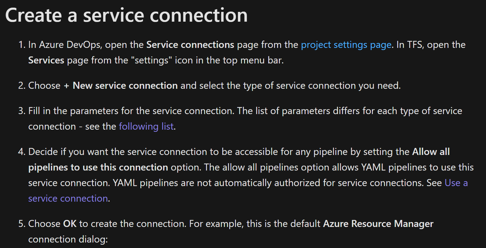
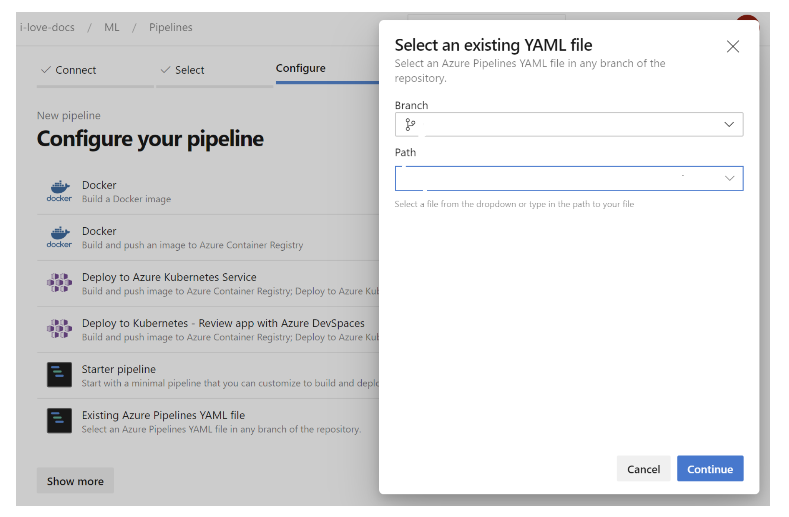

# Setup Infrastructure

This page explains how to setup an Azure architecture for your machine learning projects. The __infrastructure__ folder contains Azure Resource Manager (ARM) templates to deploy your architecture in Azure Devops (ADO) and fine-tuned it to your team's requirement.

**[ARM-Templates](../..infrastructure/arm-templates/)** contains json files to deploy specific Azure Resources (Azure ML, App Insights, etc)

* **[Pipeline full infrastructure](/../../infrastructure/pipeline-deploy-infra.yml)**: deploys the entire infrastructure. Here, you can decide how many environments (DEV,TEST,QAT,PROD) you want to have. By default, the files provide DEV and PROD, and TEST is commented out.
  
* **[Deploy one environment](/../../infrastructure/deploy-environment.template.yml)**: this file contains all the code to deploy one single environment.
  
* **[Variable configuration for instrastructure](/../../infrastructure/deploy-environment.template.yml)**: this file contains all the names you want to assign to your azure resources and location ()

## Recommended Architecture

For teams who are starting with MLOps, we suggest to have at least two Azure Machine Learning instances. 
For teams with more familiarity with MLOps and Azure, we recommend to have three environments. 

## Run Infrastructure-As-a-Code with Azure Devops Pipelines

In this section you will leverage [Azure Pipelines](https://azure.microsoft.com/en-us/services/devops/pipelines/) for the automated deployment of the infrastructure.

1. Navigate to [Azure DevOps](http://dev.azure.com/) and create a new organization and project. You can also re-use an existing organization and/or project.

2. Create a new [service connection](https://docs.microsoft.com/en-us/azure/devops/pipelines/library/service-endpoints?view=azure-devops&tabs=yaml) in Azure DevOps of the Azure Resources Manager connection type. Azure DevOps will authenticate using this connection to make deployments to your Azure Subscription. For more information about security and parameters, click on the prior link.. **We recommend to use one resource group (RG) per environment, i.e one for DEV and one for PROD**. In this case, you will need to create one service connection for each new RG.

3. Add the name of the resources groups an other azure resource(Azure ML, App Insights, etc) in [deploy-environment.template.yaml](/../../infrastructure/deploy-environment.template.yml) or use same as is.

4. Add the pipeline in ADO and run it. For that go to _pipelines_ and click on _new pipeline_ at the top right. You should see the following screen . Select: **Azure Repos Git**, the name repo where you clone this repo, **Existing Azure Pipelines YAML file** option and set the path to _/infrastructure/deploy-environment.template.yml_ and click on _continue_. In the _review_ section, click on _run_.

5. If everything has worked well, you should see your new resource groups in the Azure portal.
